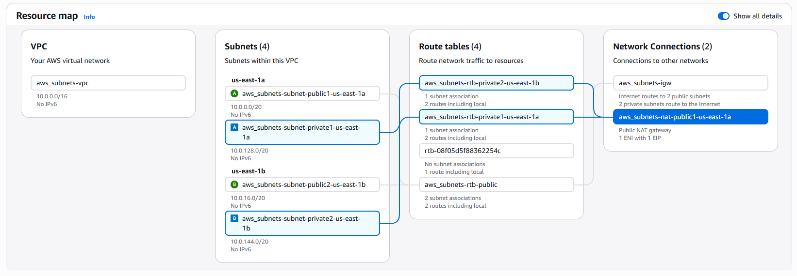

# AWS VPC and Bastion Host Architecture Lab

This project demonstrates the design and implementation of a secure AWS network architecture. The environment consists of a custom VPC with public and private subnets across multiple Availability Zones, an Internet Gateway, a NAT Gateway for outbound internet access from private resources, a Bastion Host for secure administration, and EC2 instances deployed in private subnets.

The project validates secure access patterns by connecting from a local machine to a Bastion Host in a public subnet and then securely accessing a private EC2 instance using SSH.

## Technologies Used

- Amazon VPC
- Amazon EC2
- Internet Gateway
- NAT Gateway
- Route Tables
- Security Groups
- SSH
- Ubuntu Linux

## Architecture Highlights

- Custom VPC (10.0.0.0/16)
- 2 Public Subnets
- 2 Private Subnets
- Public and Private Route Tables
- Internet Gateway for public resources
- NAT Gateway for private subnet internet access
- Bastion Host for secure administration
- Private EC2 instance accessible only through the Bastion Host

## Architecture Diagram



## Implementation Steps

1. Created a custom VPC with CIDR block `10.0.0.0/16`
2. Created public and private subnets across multiple Availability Zones
3. Attached an Internet Gateway to the VPC
4. Configured public and private route tables
5. Created a NAT Gateway for outbound internet access from private subnets
6. Launched a Bastion Host in a public subnet
7. Launched a private EC2 instance in a private subnet
8. Configured Security Groups for controlled SSH access
9. Connected from Windows to the Bastion Host
10. Connected from the Bastion Host to the Private EC2 instance

## SSH Commands Used

### Connect to Bastion Host

```bash
ssh -i Your_key_file.pem ubuntu@<BASTION_PUBLIC_IP>
```

### Copy PEM File to Bastion

```bash
scp -i Your_key_file.pem Your_key_file.pem ubuntu@<BASTION_PUBLIC_IP>:~/
```

### Secure PEM File

```bash
chmod 400 Your_key_file.pem
```

### Connect to Private EC2

```bash
ssh -i Your_key_file.pem ubuntu@<PRIVATE_EC2_IP>
```

## Validation

Successfully established connectivity:

```text
Windows Machine
    ↓
Bastion Host (Public Subnet)
    ↓
Private EC2 (Private Subnet)
```

## Screenshots

### SSH to Bastion Host


### SSH to Private EC2


## Key Learnings

- Difference between public and private subnets
- Bastion Host architecture
- Security Group configuration
- Route Table configuration
- Internet Gateway and NAT Gateway usage
- Secure SSH access patterns in AWS
- Multi-AZ VPC design
